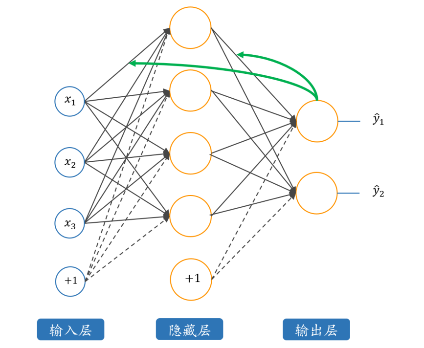

1. LeNet-5的总体架构

LeNet-5的输入是32x32的灰度图像（MNIST数据集中的图像被调整为32x32），输出是10个类别的概率分布（对应0-9的数字）。其架构由以下层组成：

输入层：32x32的灰度图像。

卷积层1（C1）：6个5x5的卷积核，输出6个28x28的特征图。

池化层1（S2）：2x2的最大池化，输出6个14x14的特征图。

卷积层2（C3）：16个5x5的卷积核，输出16个10x10的特征图。

池化层2（S4）：2x2的最大池化，输出16个5x5的特征图。

全连接层1（C5）：120个神经元。

全连接层2（F6）：84个神经元。

输出层：10个神经元（对应10个类别）。

2. 各层的详细说明

(1) 输入层

输入图像大小为32x32，灰度图像（1个通道）。

MNIST数据集中的图像原本是28x28，但LeNet-5的输入要求是32x32，因此需要对图像进行填充（padding）或调整大小。

(2) 卷积层1（C1）

卷积核大小：5x5。

输入通道：1（灰度图像）。

输出通道：6（6个卷积核）。

输出特征图大小：28x28（计算公式：(32 - 5 + 1) = 28）。

激活函数：ReLU（论文中使用的是Sigmoid，但现代实现通常使用ReLU）。

参数数量：(5*5*1 + 1) * 6 = 156（每个卷积核有5x5的权重和1个偏置）。

(3) 池化层1（S2）

池化类型：最大池化（Max Pooling）。

池化核大小：2x2。

步幅（stride）：2。

输出特征图大小：14x14（计算公式：28 / 2 = 14）。

池化层没有可训练参数。

(4) 卷积层2（C3）

卷积核大小：5x5。

输入通道：6。

输出通道：16。

输出特征图大小：10x10（计算公式：(14 - 5 + 1) = 10）。

激活函数：ReLU。

参数数量：(5*5*6 + 1) * 16 = 2416。

(5) 池化层2（S4）

池化类型：最大池化。

池化核大小：2x2。

步幅：2。

输出特征图大小：5x5（计算公式：10 / 2 = 5）。

池化层没有可训练参数。

(6) 全连接层1（C5）

输入大小：16个5x5的特征图，展平后为16*5*5 = 400。

输出大小：120。

激活函数：ReLU。

参数数量：400 * 120 + 120 = 48120。

(7) 全连接层2（F6）

输入大小：120。

输出大小：84。

激活函数：ReLU。

参数数量：120 * 84 + 84 = 10164。

(8) 输出层

输入大小：84。

输出大小：10（对应10个类别）。

激活函数：Softmax（用于多分类任务）。

参数数量：84 * 10 + 10 = 850。

3. LeNet-5的特点

卷积层的使用：

卷积层通过局部感受野和权重共享，减少了参数数量，同时保留了图像的局部结构信息。

卷积核的大小为5x5，适合捕捉手写数字的局部特征（如边缘、角点等）。

池化层的使用：

池化层通过下采样减少特征图的大小，降低计算复杂度，同时增强模型对平移、缩放等变换的鲁棒性。

LeNet-5使用最大池化（Max Pooling），保留最显著的特征。

全连接层：

全连接层将卷积层提取的特征进行组合，最终输出类别的概率分布。

LeNet-5的全连接层规模较小（120和84个神经元），适合当时的计算资源。

激活函数：

论文中使用的是Sigmoid激活函数，但现代实现通常使用ReLU，因为ReLU训练速度更快且不易出现梯度消失问题。

输出层：

输出层使用Softmax激活函数，将神经元的输出转换为概率分布。

4. LeNet-5的训练

损失函数：

使用交叉熵损失函数（Cross-Entropy Loss），适合多分类任务。

优化算法：

论文中使用的是随机梯度下降（SGD），但现代实现通常使用Adam优化器，因为它收敛更快且更稳定。

数据增强：

论文中提到通过对训练数据进行随机扭曲（如平移、缩放、旋转等）来增加数据多样性，从而提高模型的泛化能力。

训练过程：

训练时，模型通过反向传播算法更新参数，最小化损失函数。

论文中使用了权重衰减（Weight Decay）来防止过拟合。

5. LeNet-5的性能

在MNIST数据集上，LeNet-5的测试错误率约为0.95%。

通过数据增强（如随机扭曲训练图像），错误率可以进一步降低到0.8%。

6. LeNet-5的现代意义

卷积神经网络的奠基：

LeNet-5是第一个成功应用的卷积神经网络，为后续的深度学习模型（如AlexNet、VGG、ResNet等）奠定了基础。

权重共享和局部感受野：

LeNet-5通过卷积层的权重共享和局部感受野，显著减少了参数数量，同时保留了图像的局部结构信息。

池化层的引入：

池化层的使用使得模型对输入图像的平移、缩放等变换具有鲁棒性。

端到端学习：

LeNet-5实现了端到端的学习，无需手工设计特征提取器，直接从原始图像中学习特征。

